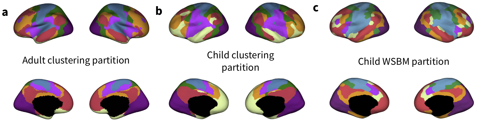

# Tooley et al., 2021

This is the repo for code and data imported directly into the manuscript:

Tooley, U. A., Mackey, A. P., & Bassett, D. S. (2021). Functional brain network community structure in childhood: Unfinished territories and fuzzy boundaries. NeuroImage, 118843. [https://doi.org/10.1016/j.neuroimage.2021.118843](https://doi.org/10.1016/j.neuroimage.2021.118843)

We provide two freely available partitions (assignments of regions to communities, also sometimes called networks), that were estimated using data from children ages 9-11. For more details, see the [manuscript](https://doi.org/10.1016/j.neuroimage.2021.118843)!

## Requirements

Preprocessing was conducted using fMRIprep v. 1.4.1 ([link](https://fmriprep.org/en/stable/)) and xcpEngine version 1.0 ([link](https://xcpengine.readthedocs.io/)) on a high-performance computing cluster running CentOS 6.9. See [manuscript](https://www.sciencedirect.com/science/article/pii/S1053811921011149#sec0003) Methods for all software version specifications.

Code used in this repo depends heavily on that of the Computational Brain Imaging Group (v0.17.0, found [here](https://github.com/ThomasYeoLab/CBIG)). This must be installed to run functions in the `code/yeo_networks` folder.

The weighted stochastic block model (WSBM, `code/wsbm`) was run using v1.2 code from Aicher et al. (2015), found [here](https://aaronclauset.github.io/wsbm/), which must be installed for MATLAB to run the WSBM. The Network Community Toolbox ([here](http://commdetect.weebly.com/)) and GenLouvain 2.1 [code](http://netwiki.amath.unc.edu/GenLouvain/GenLouvain) must also be in your MATLAB path to use the iterative WSBM consensus partitioning algorithm.

Numbers at the beginning of scripts indicate the order in which they were used. In some cases (e.g. in MATLAB), you must modify the script name to remove the number, as filenames cannot start with numeric values.

## Partitions

Both the developmental clustering partition and the developmental WSBM are provided in `fsaverage6`, `MNI152`, and `fs_LR 32k` space in the `partitions` folder. The adult clustering partition was estimated by Yeo _et al._ in their [2011 paper](https://www.ncbi.nlm.nih.gov/pmc/articles/PMC3174820/), and is available from the CBIG group [here](https://github.com/ThomasYeoLab/CBIG/tree/master/stable_projects/brain_parcellation/Yeo2011_fcMRI_clustering).

The WSBM partition is also provided as a vector of assignments for the Schaefer 400-region parcellation, available from the CBIG group [here](https://github.com/ThomasYeoLab/CBIG/tree/master/stable_projects/brain_parcellation/Schaefer2018_LocalGlobal).

## Data

The developmental clustering partition was generated using code from the [CBIG](https://github.com/ThomasYeoLab/CBIG/tree/master/stable_projects/brain_parcellation/Yeo2011_fcMRI_clustering). To run the clustering algorithm, use `code/yeo_networks/1_yeo_clustering_n670_1000x.csh`. Example inputs and expected outputs are provided in the [CBIG repository](https://github.com/ThomasYeoLab/CBIG/tree/master/stable_projects/brain_parcellation/Yeo2011_fcMRI_clustering/examples).

The developmental WSBM partition was generated using code from [Aaron Clauset](https://aaronclauset.github.io/wsbm/). To run the WSBM algorithm, use `code/wsbm/1_zscore_and_wsbm_main_sample.m`. An example script and example inputs and outputs is available in `data/example`([here](https://github.com/utooley/Tooley_2021_child_functional_comms/tree/master/data/example)).

## Manuscript

Statistics and data that are directly imported into the manuscript live in this folder.
